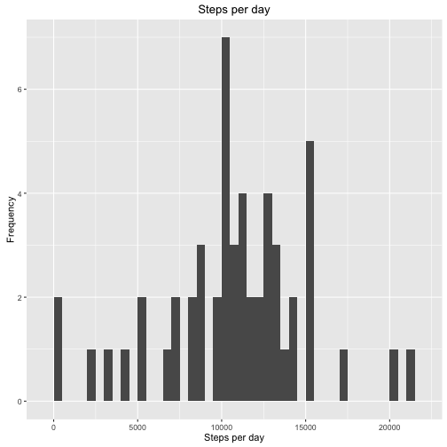
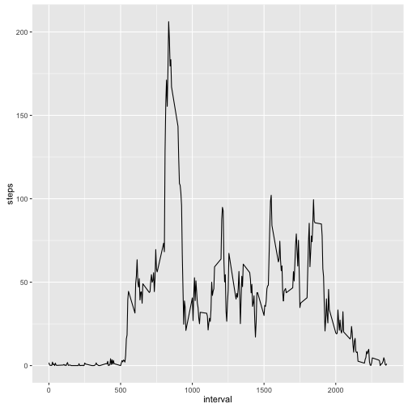
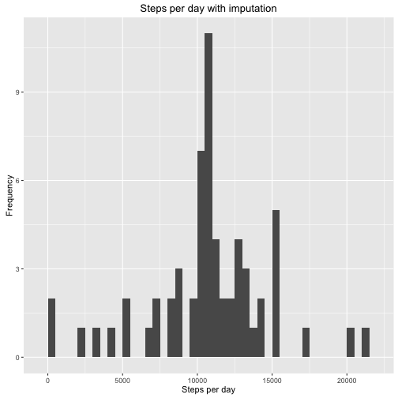
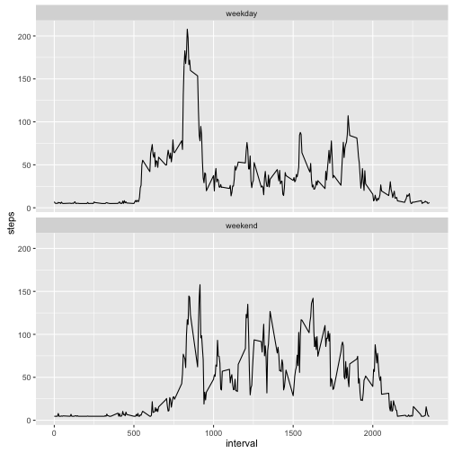

## Loading and preprocessing the data

```r
library(readr) # fast read_csv()
library(dplyr) # data wrangling
library(Hmisc) # impute()

df <- read_csv("activity.csv")
```
## What is the mean total number of steps taken per day?

```r
df %>%
    filter(!is.na(steps)) %>%
    group_by(date)        %>%
    summarise(steps = sum(steps)) ->
    steps.per.day

ggplot(steps.per.day, aes(x = steps)) +
    geom_histogram(binwidth = 500)    +
    labs(title = "Steps per day", x = "Steps per day", y = "Frequency")
```

 

```r
steps.mean   <- mean(steps.per.day$steps, na.rm = T)
steps.median <- median(steps.per.day$steps, na.rm = T)
steps.mean;steps.median
```

```
## [1] 10766.19
```

```
## [1] 10765
```
- **Mean:** 1.0766189 &times; 10<sup>4</sup> 
- **Median:** 10765 

## What is the average daily activity pattern?

```r
df %>%
    filter(!is.na(steps))     %>%
    group_by(interval)        %>%
    summarise(steps = mean(steps)) ->
    interval.avg

ggplot(interval.avg, aes(x=interval, y=steps)) +
    geom_line()
```

 

```r
interval.max <- as.numeric(interval.avg[interval.avg$steps == max(interval.avg$steps), ][1,1])
```
The interval with the max number of steps was 835.

## Imputing missing values

```r
total.nas       <- sum(is.na(df$steps))
df.impute       <- df
df.impute$steps <- impute(df.impute$steps, fun=mean)

df.impute %>%
    filter(!is.na(steps)) %>%
    group_by(date)        %>%
    summarise(steps = sum(steps)) ->
    steps.per.day

ggplot(steps.per.day, aes(x = steps)) +
    geom_histogram(binwidth = 500)    +
    labs(title = "Steps per day with imputation", x = "Steps per day", y = "Frequency")
```

 

```r
steps.mean   <- mean(steps.per.day$steps, na.rm = T)
steps.median <- median(steps.per.day$steps, na.rm = T)
```
There are 2304 missing values.
The mean of steps with missing values imputed is 1.0766189 &times; 10<sup>4</sup> 
The median of steps with missing values imputed is 1.0766189 &times; 10<sup>4</sup> 

## Are there differences in activity patterns between weekdays and weekends?

```r
df.impute %>%
    mutate(weektype = ifelse(weekdays(date) == "Saturday" 
                             | weekdays(date) == "Sunday"
                             , "weekend", "weekday")) %>%
    group_by(interval, weektype)                      %>%
    summarise(steps = mean(steps)) ->
    interval.avg

ggplot(interval.avg, aes(x=interval, y=steps)) +
    geom_line() +
    facet_wrap(~weektype, ncol = 1, nrow=2)
```

 
